# Curso básico del uso y configuración de git

- [Curso básico del uso y configuración de git](#curso-b%c3%a1sico-del-uso-y-configuraci%c3%b3n-de-git)
  - [Descarga del programa para tener la terminal de Git Bash](#descarga-del-programa-para-tener-la-terminal-de-git-bash)
  - [Crear una cuenta en github](#crear-una-cuenta-en-github)
  - [Configuración en la terminal de git para relacionar tu computador con tu cuenta de GitHub](#configuraci%c3%b3n-en-la-terminal-de-git-para-relacionar-tu-computador-con-tu-cuenta-de-github)
  - [Agregar una clave rsa en Git Hub](#agregar-una-clave-rsa-en-git-hub)
  - [Creación de un nuevo repositorio](#creaci%c3%b3n-de-un-nuevo-repositorio)
  - [Cómo agregar archivos a un Repositorio desde el Git Bash](#c%c3%b3mo-agregar-archivos-a-un-repositorio-desde-el-git-bash)
  - [Regresar a versiones antiguas](#regresar-a-versiones-antiguas)

## Descarga del programa para tener la terminal de Git Bash

* **Paso 1**: entramos a la página de [git-scm.com](https://git-scm.com) para descargar nuestro archivo de instalación. Nos encontraremos con una ventana como la que se mostrará más adelante; o quiza una diferente dependiendo en que año estes siguiendo esta información.


* **Paso 2**: en la parte inferior, observaremos una imagen de una pequeña computadora, donde esta la opción de descarga del archivo, y daremos clic allí.

* **Paso 3**: ejecutamos el programa que se ha descargado en la ubicación que tiene indicado tu ordenador; o simplemente dale un clic desde tu navegador para ejecutar.

* **Paso 4**: la continuación de la instalación es muy simple. Te sugiero que lo mantengas con las opciones por default. En caso contrario, lo puedes configurar o cambiar la ruta de destino de instalación o como lo veas más conveniente.

## Crear una cuenta en github

Antes de continuar con la configuración de la terminal de git, es muy importante tener una cuenta en github; por lo tanto te explicaré brevemente como crearla. Algo muy importante, es que debes tener una cuenta de correo que puedas tener acceso a el, ya que tendras que realizar una verificación durante el proceso. Si no tienes una cuenta de correo, deberás crearla.

* **Paso 1**: primeramente nos vamos a dirigir a la página principal de [github.com](https://github.com) para poder crear una cuenta nueva. si tu ya tienes una cuenta creada, puedes omitir estos pasos y dirigirte directamente a la configuracion en la terminal.
    Entrando al link de arriba, nos aparecerá una ventana como la siguiente:


* **Paso 2**: estando en la página principal, podremos observar en una barra color verde que nos dice "Registrarse en GitHub", o también en la parte de arriba veremos una opción que dice "Registrarse". En cualquiera de los dos lugares podemos dar clic para registrarse.

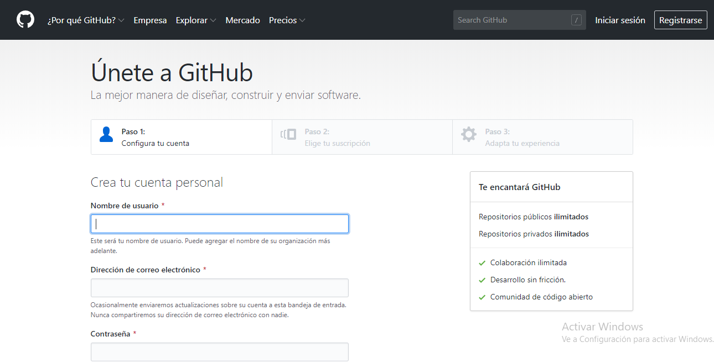.

* **Paso 3**: tienes que agregar los datos que se te pide como tu usuario y contraseña.
    Como podrás ver, debes de seguir tres pasos en la página para crear tu cuenta. No es muy difícil así que espero y no tengas alguna dificultad.
Como recomendación, sugiero que leas cada paso y proceso para crear tu cuenta y así puedas agregar todo correctamente.

* **Paso 4**: una vez agregado todos los datos deberás ir a tu cuenta de correo que ingresaste y debes verificar tu cuenta recien creada; y eso es todo para esta parte.

## Configuración en la terminal de git para relacionar tu computador con tu cuenta de GitHub

Cuando mencione alguna línea de comando, derás quitar las comillas, al menos que se mencione que sí las debe llevar.

* **Paso 1**: primero vamos a buscar entre los programas instalados la aplicación que se llama Git Bash. Puedes presionar el botón de incio y escribir el nombre, y te aprecerá el programa, y le das clic para que se ejecute.

* **Paso 2**: una vez abierto el programa, te aparecerá una ventana como la siguiente:

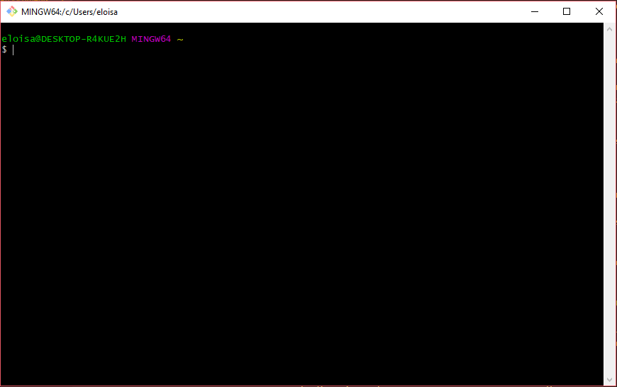

* **Paso 3**: En caso que se inicie con una ubicación diferente, puedes poner en la linea de comandos el siguiente comando, sin las comillas "cd ~" y das enter; te deberá aparecer como la imagen anterior.

* **Paso 4**: vamos a iniciar a escribir los primeros comandos. Primero escribe el siguiente comando, así como se muestra en la imagen y das enter:

```Bash
git config --global user.name "aquí agregas el nombre de usuario de tu cuenta de Git Hub con las comillas"
```

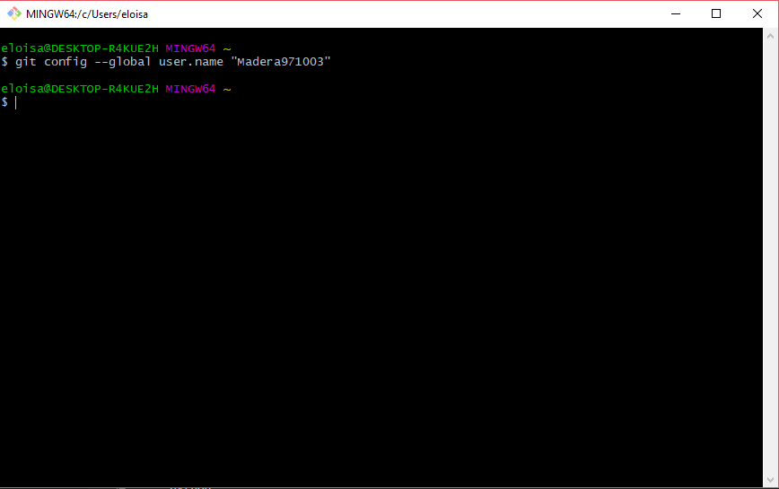

* **Paso 5**: ahora se agregará el correo que usaste cuando creaste tu cuenta de Git Hub con el siguiente comando como se muestra en la imagen, y das enter:

```Bash
git config --global user.email Aquí-escribes-tu-correo-pero-sin-comillas
```

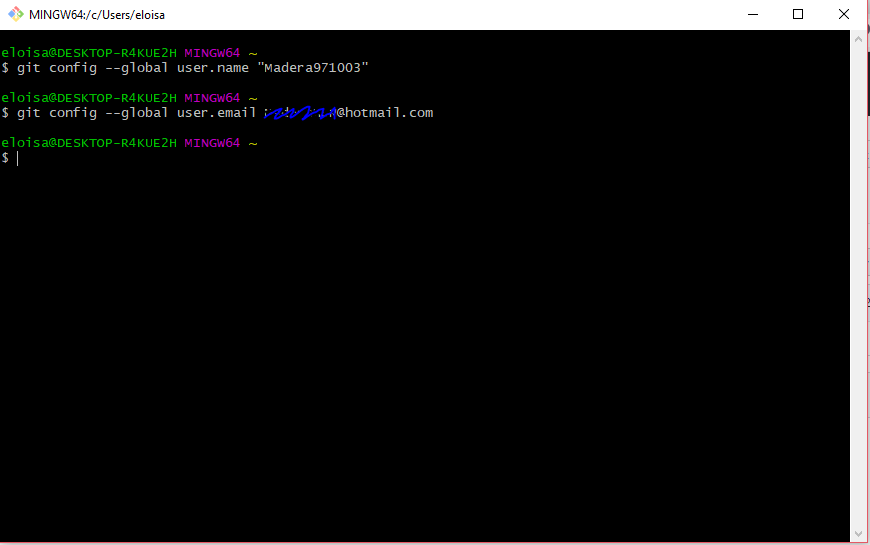

* **Paso 6**: para verificar que todo este hecho de manera correcta, verificamos con el siguiente comando y das enter:

```Bash
git config --list
```

Los datos que ingresaste, deberan estar hasta el final como se muestra en la imagen siguiente:

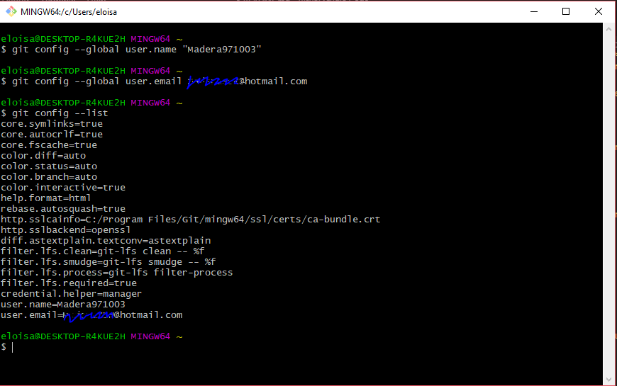

## Agregar una clave rsa en Git Hub

* **Paso 1**: ahora se generará una clave ssh usando el siguiente comando:

```Bash
ssh-keygen -o -t rsa -b 4096 -C "aquí agregas tu correo con las comillas"
```

Una vez que le des enter, empezará a cargar, en mi caso ya tenía uno existente y me pidió si quería sobreescribir, por eso le escribí "y" para decirle que SÍ.
Después pide que se agregue unsa frase; te recomiendo que solo le des enter, porque luego puede que no recuerdes la frase. Y te pedirá que confirmes la frase, pero le vuelves a dar enter.
Al final quedará creado el ssh en la ubucación como se marca en la imagen:

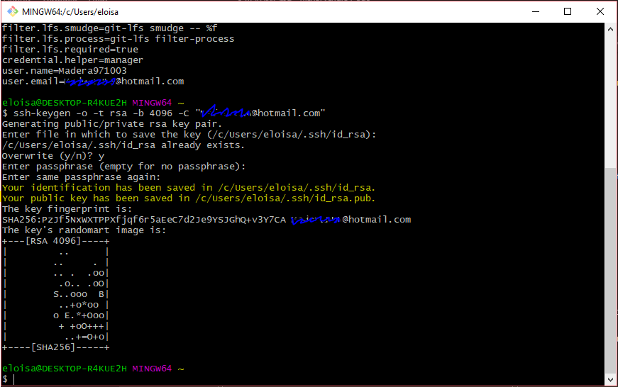

* **Paso 2**: ahora se abrirá el archivo id-rsa en la ubicación que se marcó en la linea de comandos de la siguiente:

Este archivo, contiene por así decirlo, la clave que se usará para hacer la conexión entre nuestra cuenta de Git Hub y nuestro computador.
Primero vamos a la ubicación del archivo, y hacemos lo siguiente como se muestra en la imagen, clic derecho y seleccionamos "Git Bash Here":

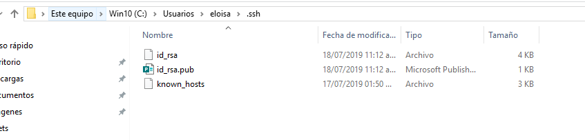

Por último se escribe lo siguiente; es muy importante que le escribas ".pub":

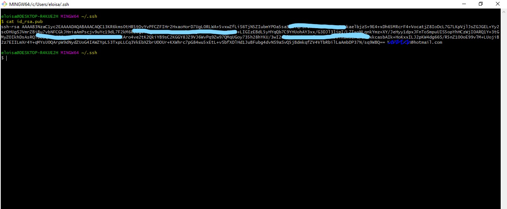

* **Paso 3**: ahora deberás ir a tu cuenta de Git Hub, y seleccionamos "Settings".

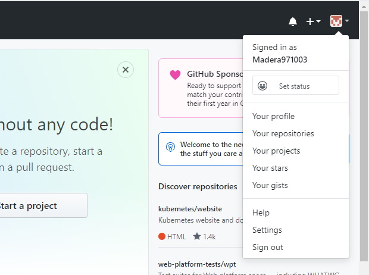

* **Paso 4**: nos aparecera algo como esto. Y estando en esta parte, se selecciona la opción de "SSH and GPG keys".

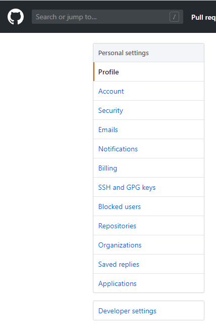

* **Paso 5**: vamos a darle clic en la opción de "New SSH key" para agregar uno nuevo.


* **Paso 6**: agregamos un nombre a nuestra clave y copiamos el texto que contiene nuestro id-rsa de la línea de comandos, le damos agregar y después nos pedira la contraseña de la cuenta para confirmar.

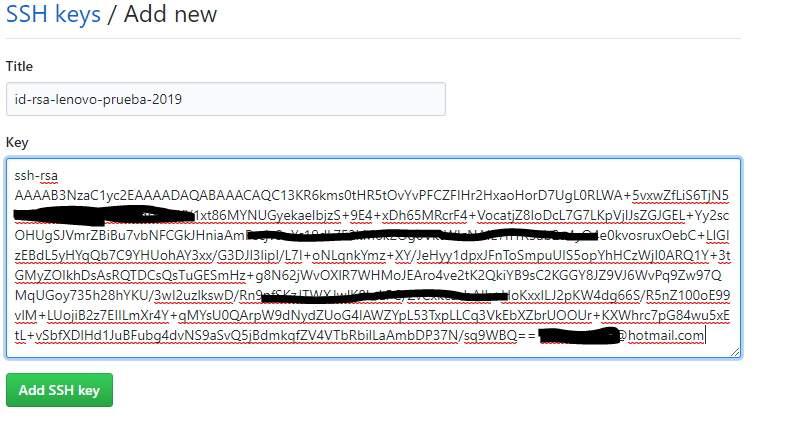

## Creación de un nuevo repositorio

* **Paso 1**: nos vamos a la cuenta de Git Hub, y damos clic en "Your repositories" así como se muestra en la imagen:


* **Paso 2**: Estando en la ventana que se muestras más adelante, vamos a crear un repositorio nuevo.

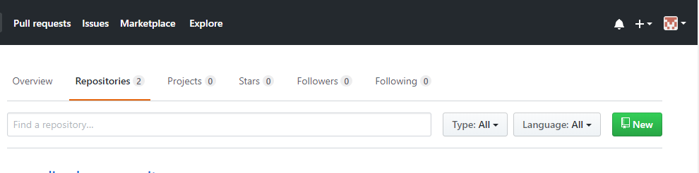

* **Paso 3**: Agregamos los datos que se nos pide, y le damos en crear.

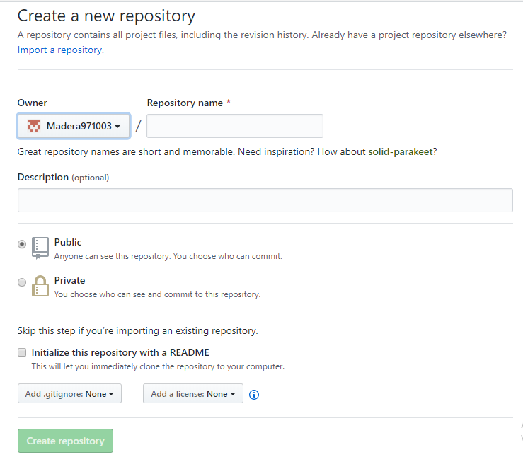

* **Paso 4**: Nos aparecerá una ventana como la siguiente:

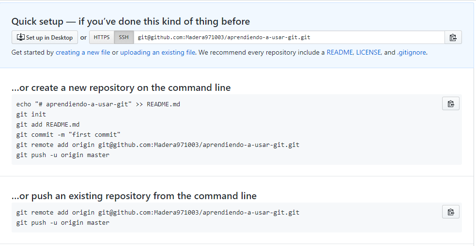

## Cómo agregar archivos a un Repositorio desde el Git Bash

* **Paso 1**: primero abrimos Git Bash y nos vamos a la ubicación de la carpeta con el proyecto que pretendes subir.

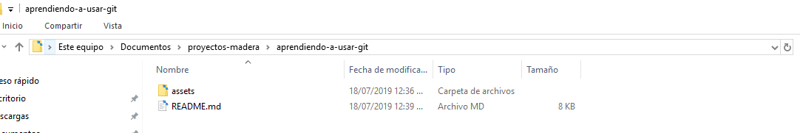

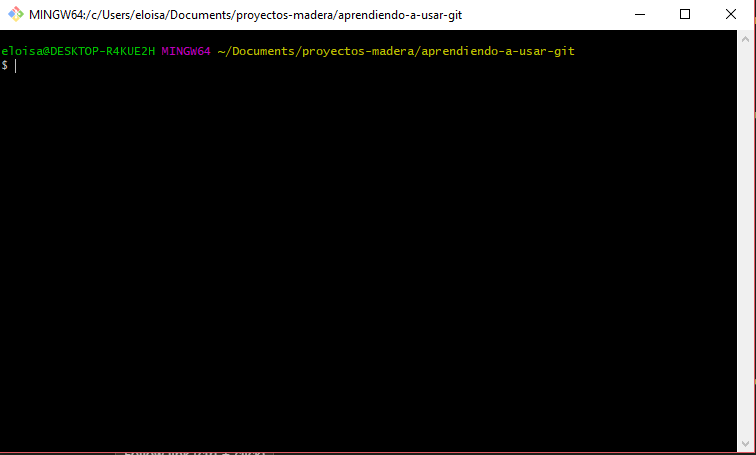

* **Paso 2**: ahora se escribe el siguiente comando para inicializar:

```Bash
git init
```

Deberá aparecer la palabra "master".

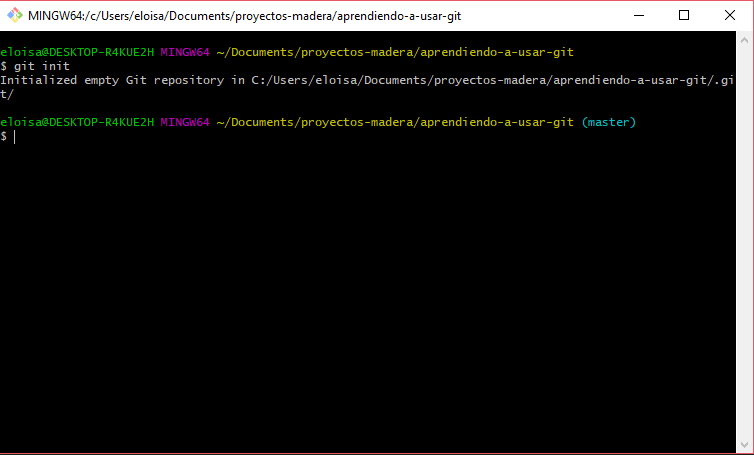

* **Paso 3**: del paso 4 de lo anterior, en la imagen en mi caso aparece el comando sig:

```Bash
git remote add origin git@github.com:Madera971003/aprendiendo-a-usar-git.git
```

En tu caso deberás copiar el que te aparece a ti en la línea de comandos, de la siguiente forma dando un enter:

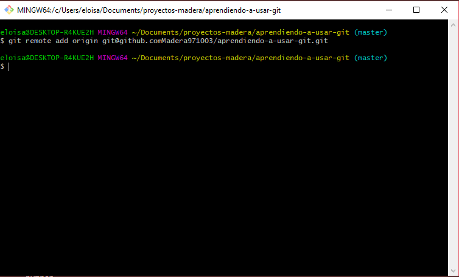

* **Paso 4**: ahora ya podemos empezar a agregar nuestro pequeño proyecto. Usando uno de los comandos de abajo, agregamos los archivos.

Este comando, nos agregará todos los archivos que tenemos en la carpeta donde estamos ubicado.

```Bash
git add -A
```

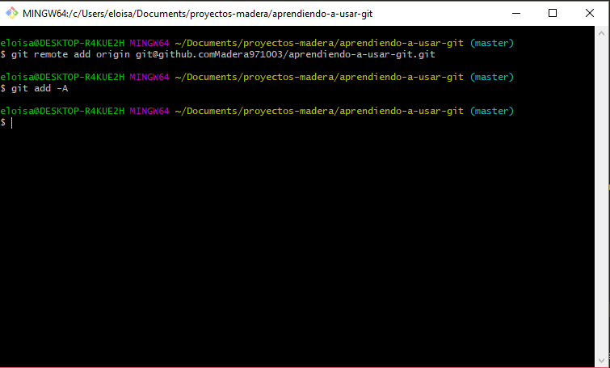

Este comando, nos agrega un archivo en específico. Debes poner la extensión del archivo que estes agregando.

```Bash
git add name-file.extension
```

* **Paso 5**: algo que debes tomar en cuenta siempre, aunque sea un poco aburrido, tardado o quizá "innecesario", es poner comentarios siempre de que estes modificando, o que estes realizando alguna acción.

Los comentarios se ponen de la siguiente manera con las comillas:

```Bash
git commit -m "Comentario  de la acción que estes haciendo"
```

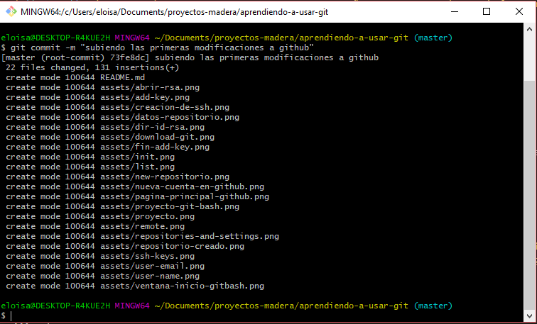

* **Paso 6**: para que todos los archivos queden visualizados en la cuenta de Git Hub, es necesario el siguiente comando:

Este comando solo se usa una primera vez.

```Bash
git push -u origin master
```

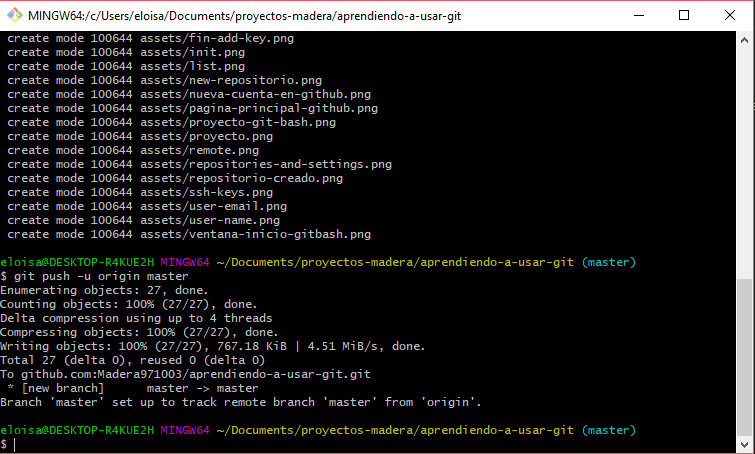

Para modificaciones a futuro, solo se usa:

```Bash
git push
```

## Regresar a versiones antiguas

Resgresear a versiones antiguas, es de mucha utilidad. En muchas ocaciones realizamos modificaciones que no nos gustan y queremos la versión anterior. En Git Hub tienes la opción de regresar a versiones anteriores.
Por eso es muy importante que los comentarios que agregas sean lo más descriptivo posible, para que sepas en que versión debes regresar. Ya que si cometes el error en regresar en una versión que no era la que querías, ya no podras regresar a versiones "futuras".
Más adelante se muestra como realizarlo.

* **Paso 1**: primero debes ver las versiones que has hecho y las cosas que has modificado, para que sepas a que versión debes regresar; por lo tanto se usa el comando siguiente:

```Bash
git log
```

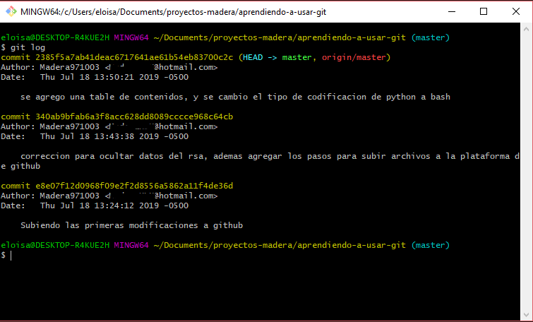

**Aún faltan más pasos :( .**
