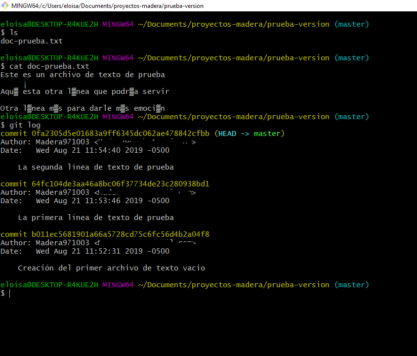
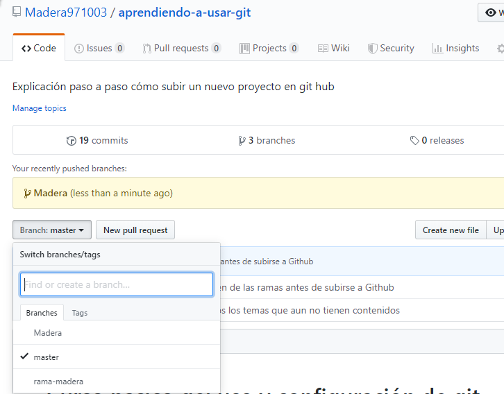

# Curso básico del uso y configuración de git

- [Curso básico del uso y configuración de git](#curso-b%c3%a1sico-del-uso-y-configuraci%c3%b3n-de-git)
  - [Descarga del programa para tener la terminal de Git Bash](#descarga-del-programa-para-tener-la-terminal-de-git-bash)
  - [Crear una cuenta en github](#crear-una-cuenta-en-github)
  - [Configuración en la terminal de git para relacionar tu computador con tu cuenta de GitHub](#configuraci%c3%b3n-en-la-terminal-de-git-para-relacionar-tu-computador-con-tu-cuenta-de-github)
  - [Agregar una clave rsa en Git Hub](#agregar-una-clave-rsa-en-git-hub)
  - [Creación de un nuevo repositorio](#creaci%c3%b3n-de-un-nuevo-repositorio)
  - [Cómo agregar archivos a un Repositorio desde el Git Bash](#c%c3%b3mo-agregar-archivos-a-un-repositorio-desde-el-git-bash)
  - [Regresar a versiones antiguas](#regresar-a-versiones-antiguas)
  - [Comparación de versiones de archivos](#comparaci%c3%b3n-de-versiones-de-archivos)
    - [Comparación de versión reciente con antigua](#comparaci%c3%b3n-de-versi%c3%b3n-reciente-con-antigua)
    - [Comparación de versión antigua con reciente](#comparaci%c3%b3n-de-versi%c3%b3n-antigua-con-reciente)
    - [Casos de binarios y otros caracteres](#casos-de-binarios-y-otros-caracteres)
    - [Ventana de características y detalles](#ventana-de-caracter%c3%adsticas-y-detalles)
  - [Ramas (Branches)](#ramas-branches)
    - [Creación de ramas y moverse en ramas](#creaci%c3%b3n-de-ramas-y-moverse-en-ramas)
      - [Dar permiso a Colaboradores](#dar-permiso-a-colaboradores)
    - [Subir ramas a Github](#subir-ramas-a-github)
    - [Merge de una rama con otra](#merge-de-una-rama-con-otra)
      - [Cherry Pick](#cherry-pick)
    - [Eliminar ramas](#eliminar-ramas)
    - [Cambiar de nombre a una rama](#cambiar-de-nombre-a-una-rama)
    - [Restringir rama Master](#restringir-rama-master)
  - [Tags](#tags)
    - [Creación de Tag](#creaci%c3%b3n-de-tag)
    - [Subir Tag a Github](#subir-tag-a-github)
    - [Eliminar Tags](#eliminar-tags)
  - [Clonación de proyectos](#clonaci%c3%b3n-de-proyectos)
  - [Pull Request](#pull-request)
    - [Creación de un Pull Request](#creaci%c3%b3n-de-un-pull-request)
    - [Pedir opiniones o puntos de vista a equipo](#pedir-opiniones-o-puntos-de-vista-a-equipo)
    - [Merge del Pull Request con master](#merge-del-pull-request-con-master)
  - [Fork](#fork)

## Descarga del programa para tener la terminal de Git Bash

* **Paso 1**: entramos a la página de [git-scm.com](https://git-scm.com) para descargar nuestro archivo de instalación. Nos encontraremos con una ventana como la que se mostrará más adelante; o quiza una diferente dependiendo en que año estes siguiendo esta información.


* **Paso 2**: en la parte inferior, observaremos una imagen de una pequeña computadora, donde esta la opción de descarga del archivo, y daremos clic allí.

* **Paso 3**: ejecutamos el programa que se ha descargado en la ubicación que tiene indicado tu ordenador; o simplemente dale un clic desde tu navegador para ejecutar.

* **Paso 4**: la continuación de la instalación es muy simple. Te sugiero que lo mantengas con las opciones por default. En caso contrario, lo puedes configurar o cambiar la ruta de destino de instalación o como lo veas más conveniente.

## Crear una cuenta en github

Antes de continuar con la configuración de la terminal de git, es muy importante tener una cuenta en github; por lo tanto te explicaré brevemente como crearla. Algo muy importante, es que debes tener una cuenta de correo que puedas tener acceso a el, ya que tendras que realizar una verificación durante el proceso. Si no tienes una cuenta de correo, deberás crearla.

* **Paso 1**: primeramente nos vamos a dirigir a la página principal de [github.com](https://github.com) para poder crear una cuenta nueva. si tu ya tienes una cuenta creada, puedes omitir estos pasos y dirigirte directamente a la configuracion en la terminal.
    Entrando al link de arriba, nos aparecerá una ventana como la siguiente:


* **Paso 2**: estando en la página principal, podremos observar en una barra color verde que nos dice "Registrarse en GitHub", o también en la parte de arriba veremos una opción que dice "Registrarse". En cualquiera de los dos lugares podemos dar clic para registrarse.

.

* **Paso 3**: tienes que agregar los datos que se te pide como tu usuario y contraseña.
    Como podrás ver, debes de seguir tres pasos en la página para crear tu cuenta. No es muy difícil así que espero y no tengas alguna dificultad.
Como recomendación, sugiero que leas cada paso y proceso para crear tu cuenta y así puedas agregar todo correctamente.

* **Paso 4**: una vez agregado todos los datos deberás ir a tu cuenta de correo que ingresaste y debes verificar tu cuenta recien creada; y eso es todo para esta parte.

## Configuración en la terminal de git para relacionar tu computador con tu cuenta de GitHub

Cuando mencione alguna línea de comando, derás quitar las comillas, al menos que se mencione que sí las debe llevar.

* **Paso 1**: primero vamos a buscar entre los programas instalados la aplicación que se llama Git Bash. Puedes presionar el botón de incio y escribir el nombre, y te aprecerá el programa, y le das clic para que se ejecute.

* **Paso 2**: una vez abierto el programa, te aparecerá una ventana como la siguiente:


* **Paso 3**: En caso que se inicie con una ubicación diferente, puedes poner en la linea de comandos el siguiente comando, sin las comillas "cd ~" y das enter; te deberá aparecer como la imagen anterior.

* **Paso 4**: vamos a iniciar a escribir los primeros comandos. Primero escribe el siguiente comando, así como se muestra en la imagen y das enter:

```Bash
git config --global user.name "aquí agregas el nombre de usuario de tu cuenta de Git Hub con las comillas"
```


* **Paso 5**: ahora se agregará el correo que usaste cuando creaste tu cuenta de Git Hub con el siguiente comando como se muestra en la imagen, y das enter:

```Bash
git config --global user.email Aquí-escribes-tu-correo-pero-sin-comillas
```


* **Paso 6**: para verificar que todo este hecho de manera correcta, verificamos con el siguiente comando y das enter:

```Bash
git config --list
```

Los datos que ingresaste, deberan estar hasta el final como se muestra en la imagen siguiente:


## Agregar una clave rsa en Git Hub

* **Paso 1**: ahora se generará una clave ssh usando el siguiente comando:

```Bash
ssh-keygen -o -t rsa -b 4096 -C "aquí agregas tu correo con las comillas"
```

Las claves que se vana generar es una pública y una privada. Debes tener mucho cuidado con el uso de la clave privada, esa la debes mantener tu.

Una vez que le des enter, empezará a cargar, en mi caso ya tenía uno existente y me pidió si quería sobreescribir, por eso le escribí "y" para decirle que SÍ.
Después pide que se agregue unsa frase; te recomiendo que solo le des enter, porque luego puede que no recuerdes la frase. Y te pedirá que confirmes la frase, pero le vuelves a dar enter.
Al final quedará creado el ssh en la ubucación como se marca en la imagen:


* **Paso 2**: ahora se abrirá el archivo id-rsa en la ubicación que se marcó en la linea de comandos de la siguiente:

Este archivo, contiene por así decirlo, la clave que se usará para hacer la conexión entre nuestra cuenta de Git Hub y nuestro computador.
Primero vamos a la ubicación del archivo, y hacemos lo siguiente como se muestra en la imagen, clic derecho y seleccionamos "Git Bash Here":


Por último se escribe lo siguiente; es muy importante que le escribas ".pub", ya que son dos claves creadas, una pública con extensión .pub y la privada:


* **Paso 3**: ahora deberás ir a tu cuenta de Git Hub, y seleccionamos "Settings".


* **Paso 4**: nos aparecera algo como esto. Y estando en esta parte, se selecciona la opción de "SSH and GPG keys".


* **Paso 5**: vamos a darle clic en la opción de "New SSH key" para agregar uno nuevo.


* **Paso 6**: agregamos un nombre a nuestra clave y copiamos el texto que contiene nuestro id-rsa de la línea de comandos, le damos agregar y después nos pedira la contraseña de la cuenta para confirmar.


## Creación de un nuevo repositorio

* **Paso 1**: nos vamos a la cuenta de Git Hub, y damos clic en "Your repositories" así como se muestra en la imagen:


* **Paso 2**: Estando en la ventana que se muestras más adelante, vamos a crear un repositorio nuevo.


* **Paso 3**: Agregamos los datos que se nos pide, y le damos en crear.


* **Paso 4**: Nos aparecerá una ventana como la siguiente:

Si seleccionas inicializar con un README, es muy probable que no te muestre esa ventana, pero no hay problema; de todos modos más adelante explico cómo subir un proyecto al repositorio.


## Cómo agregar archivos a un Repositorio desde el Git Bash

* **Paso 1**: primero abrimos Git Bash y nos vamos a la ubicación de la carpeta con el proyecto que pretendes subir.


* **Paso 2**: ahora se escribe el siguiente comando para inicializar:

```Bash
git init
```

Deberá aparecer la palabra "master".

Una vez inicializado tu carpeta con la palabra init, ya no es necesario inicializar en alguna otra ocasión. Solo debes inicializar cuando es en una carpeta diferente.

Si en la carpeta donde creaste el init, creas una carpeta más, tampoco es necesario que inicialices adentro de esta, al menos que así lo desees.


* **Paso 3**: del paso 4 de lo anterior, en la imagen en mi caso aparece el comando sig:

```Bash
git remote add origin git@github.com:Madera971003/aprendiendo-a-usar-git.git
```

Existen dos links que te pueden aparecer, una es usando SSH y otra usando HTTPS. También más adelante estan los pasos en caso que quieras cambiarlo.

En tu caso deberás copiar el que te aparece a ti en la línea de comandos, de la siguiente forma dando un enter:


* **Paso 4**: ahora ya podemos empezar a agregar nuestro pequeño proyecto. Usando uno de los comandos de abajo, agregamos los archivos.

Este comando, nos agregará todos los archivos que tenemos en la carpeta donde estamos ubicado.

```Bash
git add -A
```

O también puedes usar el comando siguiente:

```Bash
git add .
```


Este comando, nos agrega un archivo en específico. Debes poner la extensión del archivo que estes agregando.

```Bash
git add name-file.extension
```

* **Paso 5**: algo que debes tomar en cuenta siempre, aunque sea un poco aburrido, tardado o quizá "innecesario", es poner comentarios siempre de que estes modificando, o que estes realizando alguna acción.

Los comentarios se ponen de la siguiente manera con las comillas:

```Bash
git commit -m "Comentario  de la acción que estes haciendo"
```


Pero también te puedes ahorra tiempo con el siguiente comando:

```Bash
git commit -am "Comentario que desees poner en esta parte de los cambios realizados"
```

El comando anterior, sirve para agregar todos los archivos, y al mismo tiempo colocar el comentario

* **Paso 6**: para que todos los archivos queden visualizados en la cuenta de Git Hub, es necesario el siguiente comando:

Este comando solo se usa una primera vez.

```Bash
git push -u origin master
```

También puedes utilizar el siguiente:

```Bash
git push origin master
```

Cuando le pones master, los cambios se van al master; en caso que no quieres eso, ponlo a la rama que quieras.


Para modificaciones a futuro, solo se usa:

```Bash
git push
```

## Regresar a versiones antiguas

Resgresear a versiones antiguas, es de mucha utilidad. En muchas ocaciones realizamos modificaciones que no nos gustan y queremos la versión anterior. En Git Hub tienes la opción de regresar a versiones anteriores.
Por eso es muy importante que los comentarios que agregas sean lo más descriptivo posible, para que sepas en que versión debes regresar. Ya que si cometes el error en regresar en una versión que no era la que querías, ya no podras regresar a versiones "futuras".
Más adelante se muestra como realizarlo.

* **Paso 1**: primero debes ver las versiones que has hecho y las cosas que has modificado, para que sepas a que versión debes regresar; por lo tanto se usa el comando siguiente:

```Bash
git log
```

Existen algunas formas de cómo puedes visualizar tu historial de trabajo o versiones. Te dejo algunas formas:

Las versiones de las primeras líneas, seran las versiones más recientes, mientras que las de abajo, seran las más antiguas.

```Bash
git log --stat
```

Muestra todos los comentarios con detalles.

```Bash
git log --all
```

Te muestra los comentarios con detalles y la ramificación.

```Bash
git log --all --graph
```

Te muestra cada comentario y detalles con su ramificación; es algo similar al anterior.

```Bash
git log --all --graph --decorate
```

Te muestra cada uno de los comentarios que has hecho sin tantos detalles.

```Bash
git log --all --graph --decorate --oneline
```

Muestra detalles a grandes rasgos.

```Bash
git log --all --graph --decorate --oneline --simplify-by-decoration
```



Existen dos comandos diferentes que ayudan a regresar a versiones anteriores.

```Bash
git reset <version> --hard
```

```Bash
git reset <version> --soft
```

Te explico. Cuando tu haces una modificación a tu proyecto, por lo regular agregas esos cambios y luego agregas un comentario; eso es como si tus cambios estubieran al "aire"(menciono "aire" para que te des una idea, no es que sea literal) esperando subirse a la nube, es decir a Github. El comando --soft, te regresará a la versión que quieres, pero aun te mantiene ese archivo que estaba en el "aire". En cambio el comando --hard, que es el más usado, eliminará todo hasta llegar a la versión que querías.

* **Paso2**: como se puede ver en la imagen, esta el contenido del archivo, y cada uno de los cambios realizados. Ahora se elige la versión a la que se desea regresar copiando el código del commit.


* **Paso3**: ahora se escribe el código mencionado anteriormente, con el código de la versión.

```Bash
git reset b011ec5681901a66a5728cd75c6fc56d4b2a04f8 --hard
```


Quiza en este momento te este preguntando, qué pasaría si agregaras uno de los códigos cortos cuando usas un ``git log`` diferente. Bueno, pues pasaría exactamente lo mismo, ya que esos códigos que son más cortos, son suficientemente diferente de los demás.

Ahora haciendo la prueba con el ``--soft``

En la imagen se puede ver solo me quede hasta la parte donde he subido el archivo. Así que allí aplicaré el comando.


Ahora como se puede ver en la imagen, no se ha perdido las midificaciones pero si aplico ``git log``, ya no me aparecen las versiones anteriores.


Por último ponemos un commit para que se suba la modificación y quede guardado. Después comprobamos con ``git log``.

En la imagen siguiente se muestra la imagen de lo que paso. Te explico.

Cuando trabajamos en un proyecto subimos modificaciones que no son tan relevantes que esten apareciendo en el historial. Una buena opción es usar el ``--soft`` para ello tienes que primero aplicar en el último cambio la agregación de archivo o archivos: ``git add .`` para que quede en el "aire" tus documentos. Después aplicas el ``git reset <version> --soft``, y por último agregas el comentario y compruebas con ``git log`` y te debió haber eliminado todos los commits intermedios.


## Comparación de versiones de archivos

La comparación de versiones, en muchas ocasiones, suele ser de mucha ayuda siempre y cuando los archivos sean de TEXTO PLANO; si los archivos son de tipo BINARIO, es muy difícil o "imposible" que sepas cuales han sido sus cambios.

El comando que se utiliza es el siguiente:

```Bash
git diff
```


Cuando los archivos ya han sido agregados y colocados con un commit, y aplicas el ``git diff`` no mostrará nada, pero si existe algún cambio reciente, prodras verificar los cambios con el comando.

Existen más formas para visualizar cambios creados.

### Comparación de versión reciente con antigua

Por ejemplo, si quieres ver cual es la diferencia entre la versión actual y alguna de las versiones antiguas, es muy fácil, y lo obtienes con lo siguiente:

```Bash
git diff <versión reciente> <versión antigua>
```


### Comparación de versión antigua con reciente

También puedes aplicar lo contrario; es básicamente los mismo, pero a la inversa.

```Bash
git diff <versión antigua> <versión reciente>
```


### Casos de binarios y otros caracteres

Esto es lo que pasa si usas caracteres que sean un poco extraño, o de un alfabeto diferente. Pero si te dedicas a la programación por lo regular son solo texto plano. Te hago saber esto para que tengas un poco de cuidado; pero no significa que git no lo pueda manejar, pero si quieres saber más a detalles lo que ha pasado con el documento, puedes abrir directamente el archivo si esto fuera posible.


### Ventana de características y detalles

Una última forma donde lo puedes visualizar de mejor manera, es con el siguiente comando:

```Bash
gitk
```

El comando anterior te lanzará una ventana como la que aparece abajo, donde puedes configurar que cambios quieres ver.


Si tienes muchos archivos y modificas varios al mismo tiempo, el comando también te lanzará cada una de las diferencias de cada archivo que tienes almacenado.

Si haces todo esto para archivos binarios, te mostrará muchos simbolos que son un poco complejos. Pero como te he mencionado, no significa que este mal el archivo o que sea imposible de subir o guardar.

## Ramas (Branches)

Esto es como un árbol.

**Las ramas pueden tener todo el contenido de la rama Master o de alguna otra rama.**

### Creación de ramas y moverse en ramas

La creación de una rama se hace con el siguiente comando:

```Bash
git branch <nombre de la rama>
```

Si la rama lo creamos desde la rama **Master**, quiere decir que se creará una nueva rama, y al instante se copiará todo el contenido que este tiene a la nueva rama. En cambio si la nueva rama se crea desde otra rama existente, este copiará todo lo que tenga la rama desde donde fue creado.


En la imagen se ve como si no hubiera pasado nada, pero puedes comprobar con lo siguiente:

```Bash
git branch
```

")

Por último, para cambiarse de rama, se usa lo siguiente:

```Bash
git checkout <nombre de la rama(branch)>
```


#### Dar permiso a Colaboradores

Para agregar colaboradores a un repositorio, lo haces desde tu GitHub.

* **Paso 1:** primero vas a tus repositorios de tu cuenta, y selecionas el repositorio al que deseas agregar colaboradores.

* **Paso 2:** ahora vas a los "settings" del repositorio y te aparecerá algo como la siguiente imagen:


* **Paso 3:** se da clic en la opción de Collaborators; saldrá una nueva ventana como la imagen de abajo, y allí podrás buscar al colaborador; puedes colocar el correo del colaborador, o en caso que no funcione, también puedes probar con el nombre de usuario.


* **Paso 4:** por último, solo das clic en "Add Collaborator".

El colaborador deberá ir a su correo donde verá reflejado la invitación, y él o ella aceptará si así lo desea.

### Subir ramas a Github

Subir las ramas creadas localmente no es muy complicado, y se hace de la siguiente manera:

```Bash
git push origin <nombre de rama>
```


Así es como se ve en la ventana de Github después de subir una nueva rama al repositorio.



### Merge de una rama con otra

Los "Merges", son muy útiles en el preoceso de desarrollo de un proyecto. Esto sólo se puede utilizar siempre y cuando se tengan otras ramas.

* **Paso 1:** primero debes saber qué ramas quieres unir, y de qué rama a qué rama quieres que se pasen las actualizaciones o modificaciones realizadas.

* **Paso 2:** ya que sabes en que rama deben quedar las actualizaciones, te cambias a esa rama con un ``git checkout <nombre de la rama>``; estando en la rama deseada, escribes el siguiente comando:

```Bash
git merge <nombre de la rama para hacer la unión>
```

Los merges funcionan entre ramas, así como con el master. Puedes hacer un merge llevando los datos del master a una rama así también de una rama al master.

Es muy importante tener cuidado con el uso de este comando. Si estas trabajando con un equipo en alguna empresa, trata de no usar este comando con la rama MASTER, al menos que tu seas el responsable de hacer estos tipos de cambios.

Te recomiendo que crees alguna carpeta muy aparte de tu proyecto y practiques y veas todo lo que podría pasar.

#### Cherry Pick

Cherry Pick se trata de hacer un "merge" por así decirlo, entre una rama y alguna VERSIÓN de otra. Esto se usa cuando ya tenes una parte del proyecto funcionando y sigues avanzando, pero quieres mandar solo hasta un cierto punto de lo que has trabajado. Para ello usas el Cherry Pick.

El siguiente comando lo aplicas desde la rama que llamará los cambios de otra.

```Bash
git cherry-pick <Version para hacer la unión>
```

Muchos dicen que el uso de este comando es una mala práctica; así que recomendaría que lo uses en caso de ser necesario.

### Eliminar ramas

Para eliminar una rama no es muy difícil. Pero se debe de tener cuidado con el uso del comando.

El siguiente comando te mostrará algunos detalles de la rama, y te advierte si estas seguro:

```Bash
git branch -d <nombre de la rama a eliminar>
```

El siguiente comando es cuanto estas seguro de eliminar la rama:

```Bash
git branch -D <Nombre de la rama a eliminar>
```

### Cambiar de nombre a una rama

Si por escribir rápido, te das cuenta que el nombre de la rama que creaste esta mal; hay alguna forma de cómo cambiar al nombre correcto.

En el primer caso, estando desde la rama que creaste, colocas lo siguiente:

```Bash
git branch -m <Nombre corregido de la rama>
```

En el segundo caso; estando desde otra rama. Para esto, usas lo siguiente:

```Bash
git branch -m <Nombre de la rama a corregir> <Nombre corregido de la rama>
```

### Restringir rama Master

## Tags

Si ya sabes que son los Tags, puedes saltarte esta pequeña parte.

Los Tags son cuando quieres crear versiones de tu trabajo. Imagina un programa, cuando por lo regular lanzan un nuevo programa, es muy común ver las versiones que lanzan, por ejemplo: "Versión 1.02.1", o cosas por el estilo.

Lo mismo pasa con nuestro proyecto. Cuando ya tienen una versión funcionando y quieren lanzarlo, o cuando quieren marcar el momento en que su proyecto ha estado funcionando de manera correcta, y que si llega a pasar un desastre 😐 después, puedan saber el momento exacto al que deban regresar.

Los Tags te sirven para llevar un buen control en tus proyectos.

Mas adelante te explico algunas de las tareas básicas de los Tags.

### Creación de Tag

* **Paso 1:** primero se debe de conocer la versión a la que se le va aplicar un Tag

Antes del siguiente paso, una recomendación muy importante, es que el equipo de trabajo debe saber los nombres que usaran a las versiones. Por ejemplo algo muy común es usar: `v0.1` ... `v0.2` ... etc.

* **Paso 2:** ya que copiaste el código del commit donde se le va aplicar el Tag, aplicas el siguiente código.

```Bash
git tag -a <Nombre de la versión> -m "Algún comentario con las comillas" <La versión que llevará el Tag>
```


* **Paso 3:** solo si quieres verificar que el tag se realizó de manera corecta; puedes usar algún tipo de `git log`.


### Subir Tag a Github

### Eliminar Tags

## Clonación de proyectos

## Pull Request

### Creación de un Pull Request

### Pedir opiniones o puntos de vista a equipo

### Merge del Pull Request con master

## Fork
